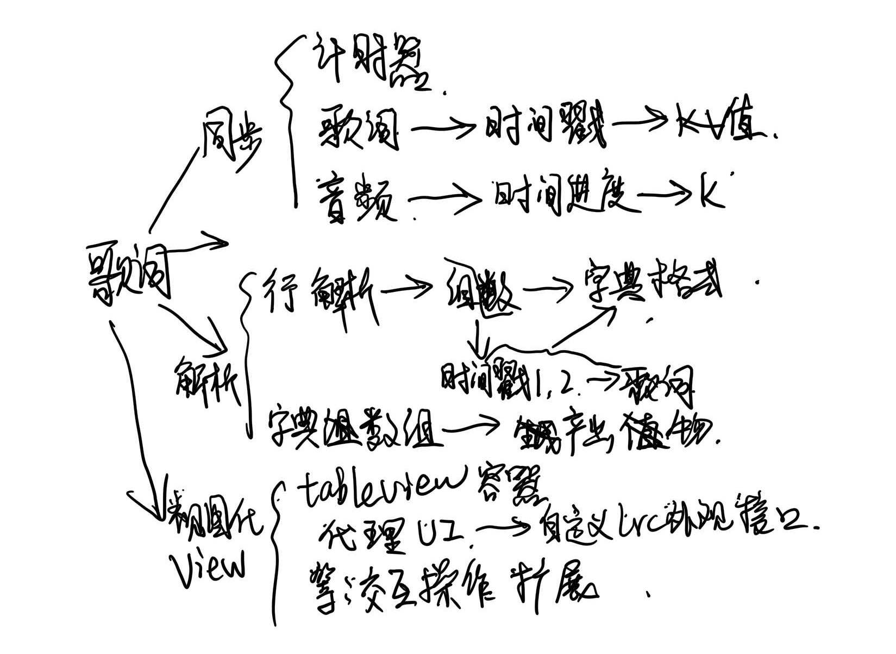

# 使用帮助

## 保留两个接口：
### 类方法
```objc
+(MusicLrcView *)shared;
```
用于初始化显示的歌词页面，其中具体实现是通过`tableView`相关接口，来实现显示和用户的相关交互功能。
```objc
[self.view addSubview:[MusicLrcView shared]];
```
### 切换歌词实例方法
-(void)switchLrcOfMusic:(NSString *)lrcPath player:(AVPlayer *)player lrcDelegate:(id<MusicLrcDelegate>)lrcDelegate;
功能：
1. 用于初始化界面之后，加载歌词到歌词界面上。
2. 在切换歌曲时，同步切换歌词
调用方式：
```objc
[[MusicLrcView shared] switchLrcOfMusic:lrcPath player:_player lrcDelegate:self];
```
`lrcPath`: lrc格式歌词路径
`_player`:播放器实例
`self`:遵循`MusicLrcDelegate`协议类自身
## 两个代理
自定义外观样式
```objc
//代理
@protocol MusicLrcDelegate <NSObject>

//重设高亮歌词颜色
-(UIColor *)setHighlightLrcColor;

-(UIColor *)setLrcColor;

@end
```


具体过程：
```objc
//添加音频路径
NSString *lrcPath = [[NSBundle mainBundle] pathForResource:@"qbd" ofType:@"lrc"];
MusicLrcView *lrcView = [MusicLrcView shared];
[lrcView switchLrcOfMusic:lrcPath player:_player lrcDelegate:self];
[self.view addSubview:lrcView];

```
